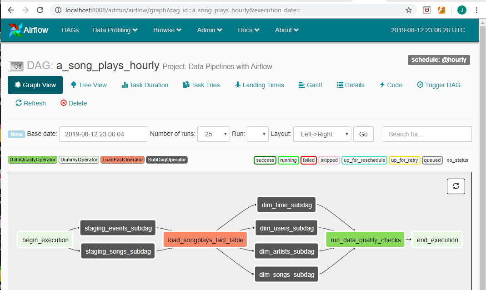
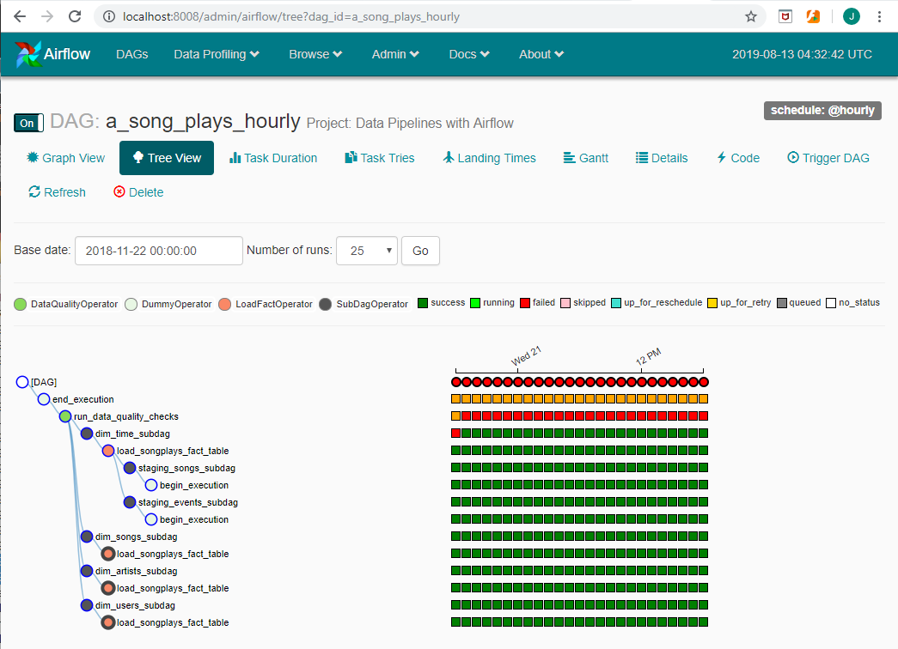

# 1. Project Introduction

## Project: Data Pipelines with Airflow

A music streaming company, Sparkify, has decided that it is time to introduce more automation and monitoring to their data warehouse ETL pipelines and come to the conclusion that the best tool to achieve this is Apache Airflow.

They have decided to bring you into the project and expect you to create high grade data pipelines that are dynamic and built from reusable tasks, can be monitored, and allow easy backfills. They have also noted that the data quality plays a big part when analyses are executed on top the data warehouse and want to run tests against their datasets after the ETL steps have been executed to catch any discrepancies in the datasets.

The source data resides in S3 and needs to be processed in Sparkify's data warehouse in Amazon Redshift. The source datasets consist of JSON logs that tell about user activity in the application and JSON metadata about the songs the users listen to.

# 2. Deliverables

## General

* The dag and plugins do not give an error when imported to Airflow
* All tasks have correct dependencies

## Dag configuration
* Defaults_args object is used in the DAG
* Defaults_args are bind to the DAG
* The DAG has a correct schedule

## Staging the data
* Task to stage JSON data is included in the DAG and uses the RedshiftStage operator
* Task uses params
* Logging used
* The database connection is created by using a hook and a connection

## Loading dimensions and facts
* Set of tasks using the dimension load operator is in the DAG
* A task using the fact load operator is in the DAG
* Both operators use params
* The dimension task contains a param to allow switch between append and insert-delete functionality

## Data Quality Checks
* A task using the data quality operator is in the DAG and at least one data quality check is done
* The operator raises an error if the check fails pass
* The operator is parametrized

# 3. Setup
To avoid aws expenses, I performed the majority of the tasks on my local Windows 10 machine.

The software configuration is as follows:
|Item|Version|
|----|-------|
|Microsoft Windows 10 Home|10.0.18362 Build 18362
|Ubuntu|18.04 LTS
|Python|3.6.8
|PostgreSQL|11.5.1
|Airflow|pip3 install apache-airflow[postgres]

# 4. Files
|filename|comment|
|--------|-------|
|..\airflow\dags\a_song_plays_dim_subdag.py|subdag used for dimension tables
|..\airflow\dags\a_song_plays_hourly.py|main dag
|..\airflow\dags\a_song_plays_stg_subdag.py| subdag used for staging tables
|..\airflow\dags\sql_statements.py|contains create table sql for staging tables
|..\airflow\plugins\__init__.py|contains helpers and operators
|..\airflow\plugins\helpers\__init__.py|contains SqlQueries
|..\airflow\plugins\helpers\sql_queries.py|contains dml sql statements for the fact and dimension tables
|..\airflow\plugins\operators\__init__.py|contains operators
|..\airflow\plugins\operators\data_quality.py|operator used for data quality checks
|..\airflow\plugins\operators\has_rows.py|operator used to determine if a table has rows
|..\airflow\plugins\operators\load_dimension.py|operator used to load the dimension tables
|..\airflow\plugins\operators\load_fact.py|operator used to load the fact table
|..\airflow\plugins\operators\stage_redshift.py|operator used to copy s3 data to a redshift cluster

# 5. Graph View

<p style="text-align: center;">DAG: a_song_plays_hourly</p>

### Default Arguments
start date: `2018-11-21T00:00:00+00:00` Number of runs: `25`

end date: `2018-11-22T00:00:00+00:00`

The DAG: a_song_plays_hourly was automatically executed using an hourly schedule. Since the date range spans 1 day there will be 25 runs of this dag. 1 run per hour plus 1. It takes approximately 3 minutes to execute each run when using a postgres database. So the 25 runs should be completed in 75 minutes.

# 6. Tree View

<p style="text-align: center;">DAG: a_song_plays_hourly</p>

## 1st run
### dim_time_subdag - failed
### log
```
[2019-08-12 22:03:19,933] {logging_mixin.py:95} INFO - [2019-08-12 22:03:19,932] {base_hook.py:84} INFO - Using connection to: id: redshift. Host: dwhcluster.ctiqkvd8ugde.us-west-2.redshift.amazonaws.com, Port: 5439, Schema: dwh, Login: dwhuser, Password: XXXXXXXX, extra: {}

[2019-08-12 22:03:20,776] {taskinstance.py:1047} ERROR - Data quality check failed. time contains 0 records
```
This was expected... Time dimension is populated using the timestamp from the songplay fact table. Songplay was not populated because of staging table selection criteria (i.e. where clause) for this hour range.

```
INSERT INTO songplays
SELECT
    --md5(events.sessionid || events.start_time) songplay_id,
    (events.sessionid::text || events.start_time::text) as playid,
    events.start_time,
    events.userid::int as userid,
    events.level,
    songs.song_id as songid,
    songs.artist_id as artistid,
    events.sessionid,
    events.location,
    events.useragent 
FROM
    (
        SELECT
            TIMESTAMP 'epoch' + ts / 1000 * interval '1 second' AS start_time,
            * 
        FROM
            staging_events 
        WHERE
            page = 'NextSong' 
    )
    events 
    JOIN
        staging_songs songs 
        ON events.song = songs.title 
        AND events.artist = songs.artist_name 
        AND events.length = songs.duration

        WHERE 1 = 1
        AND to_char(events.start_time,'YYYY-MM-DD"T"HH24:00:00"+"00:00') > '2018-11-20T23:00:00+00:00'
        AND to_char(events.start_time,'YYYY-MM-DD"T"HH24:00:00"+"00:00') < '2018-11-21T01:00:00+00:00'
```

## 2nd run
### run_data_quality_checks - failed
### log
```
[2019-08-12 22:08:05,974] [0m - SUCCESS - Data quality check passed. staging_events contains 8056 records

[2019-08-12 22:08:05,974] [0m - SUCCESS - Data quality check passed. staging_songs contains 14896 records

[2019-08-12 22:08:05,974] [0m - SUCCESS - Data quality check passed. songplays contains 2 records

[2019-08-12 22:08:05,974] [0m - SUCCESS - Data quality check passed. artists contains 195 records

[2019-08-12 22:08:05,974] [0m - SUCCESS - Data quality check passed. songs contains 210 records

[2019-08-12 22:08:05,974] [0m - SUCCESS - Data quality check passed. time contains 2 records

[2019-08-12 22:08:05,974] [0m - SUCCESS - Data quality check passed. users contains 55 records

[2019-08-12 22:08:05,974] [0m - ERROR - Data quality check failed. artists.latitude is null...actual 121 does not equal expected 0

[2019-08-12 22:08:05,974] [0m - ERROR - Data quality check failed. artists.location is null...actual 61 does not equal expected 0

[2019-08-12 22:08:05,974] [0m - ERROR - Data quality check failed. artists.longitude is null...actual 121 does not equal expected 0

[2019-08-12 22:08:05,974] {taskinstance.py:1047} ERROR - Data quality check failed.
```
## Final run
### run_data_quality_checks - failed
### log
```
[2019-08-12 23:30:35,726] [0m - SUCCESS - Data quality check passed. staging_events contains 8056 records

[2019-08-12 23:30:35,726] [0m - SUCCESS - Data quality check passed. staging_songs contains 14896 records

[2019-08-12 23:30:35,726] [0m - SUCCESS - Data quality check passed. songplays contains 18 records

[2019-08-12 23:30:35,726] [0m - SUCCESS - Data quality check passed. artists contains 195 records

[2019-08-12 23:30:35,726] [0m - SUCCESS - Data quality check passed. songs contains 210 records

[2019-08-12 23:30:35,727] [0m - SUCCESS - Data quality check passed. time contains 18 records

[2019-08-12 23:30:35,727] [0m - SUCCESS - Data quality check passed. users contains 55 records

[2019-08-12 23:30:35,727] [0m - ERROR - Data quality check failed. artists.latitude is null...actual 121 does not equal expected 0

[2019-08-12 23:30:35,727] [0m - ERROR - Data quality check failed. artists.location is null...actual 61 does not equal expected 0

[2019-08-12 23:30:35,727] [0m - ERROR - Data quality check failed. artists.longitude is null...actual 121 does not equal expected 0

[2019-08-12 23:30:35,727] {taskinstance.py:1047} ERROR - Data quality check failed.
```
## aws Redshift
### Query editor

`Star Schema Query`
```
select sp.*, t.*, u.*, s.*, a.*  
from public."songplays" sp
join public."time" t
on sp.start_time = t.start_time
join public."users" u
on sp.userid = u.userid
join public."songs" s
on sp.songid = s.songid
join public."artists" a
on sp.artistid = a.artistid;
```

### Results
For the most part, the songplays fact table contains clean data and the related dimensional data is clean in that the primary key is unique. I used an inner join as opposed to a left outer join so as to reduce the amount of **bad** data that was extracted and loaded. Please refer to the SQLQueries helper. 

## Suggestions for improvement
* create a snowflake dimension called user_levels and populate with users levels. A user can have 1 to many levels.
* incorporate foreign key relationships between the fact table and the dimensions.
* nulls are bad! remove/replace nulls wherever possible.

### Project: Data Pipelines CONCEPTS
can be found in the `Project-Data-Pipelines-with=Airflow-concepts.md` file.

### Project Rubric
can be found in the `Project-Data-Pipelines-with-Airflow-rubric.md` file.
